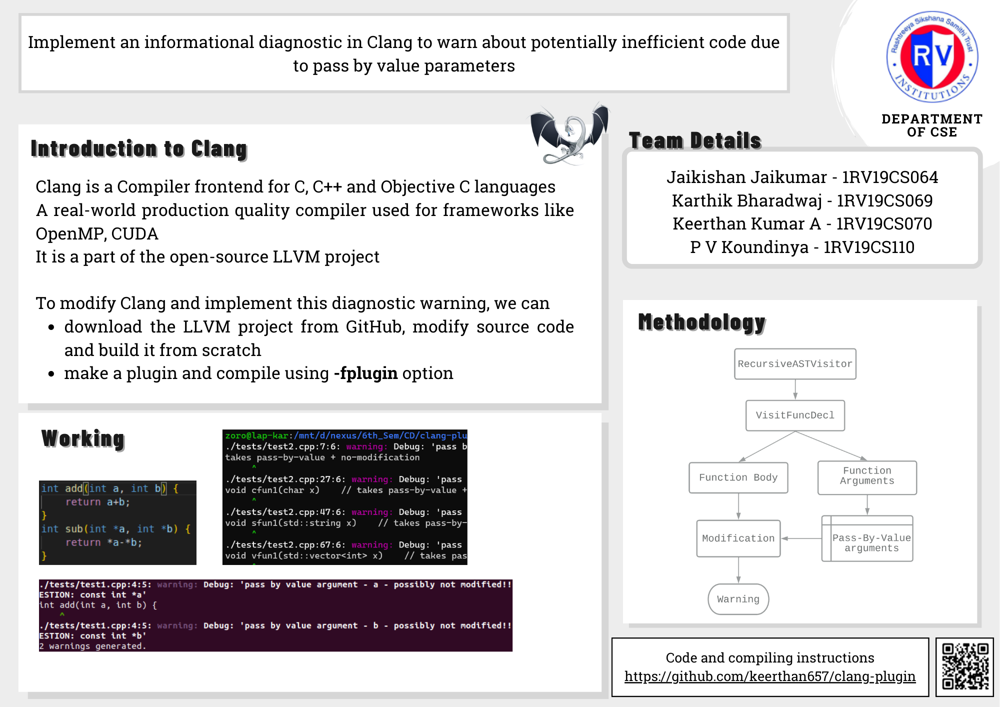

# clang-plugin
Clang diagnostic plugin to warn users about modified pass-by-value arguments in function declarations

Credits to mahesh-hegde<br>
For more information, refer here: https://github.com/mahesh-hegde/clang_diag_plugin

For compiling, use this command:<br>
```console
cmake . && cmake --build .
clang-11 -lstdc++ -fplugin=./CS01.so ./tests/test1.cpp
```

Use **bear** for the first time, to setup autocompletion tools
```console
cmake . && bear cmake --build .
clang-11 -lstdc++ -fplugin=./CS01.so ./tests/test1.cpp
```

### Team details
Jaikishan Jaikumar - 1RV19CS064<br>
Karthik Bharadwaj - 1RV19CS069<br>
Keerthan Kumar A - 1RV19CS070<br>
P V Koundinya - 1RV19CS110<br>

## Introduction
This project is part of 6th semester Compiler Design selfstudy<br>

### Problem statement
Implement an informational message/diagnostic in Clang to warn about potentially inefficient code due to pass by value parameters
<br>

A diagnostic should be issued for a function written as follows:<br>
&nbsp;&nbsp;&nbsp;&nbsp;void some_function(std::string str);<br>
with a suggestion to rewrite it as:<br>
&nbsp;&nbsp;&nbsp;&nbsp;void some_function(const std::string *str);<br>

## Methodology
Step 1: Check if the parameters being passed to the function are being modified, if so place them in a vector.<br>
Step 2: Check the parameters of the function one by one, to see if they satisfy the following criteria: <br>
- should not be a pointer/a pass by reference<br>
- should not be in the vector<br>

Step 3: If the above criteria are satisfied, display a warning with a suitable suggestion for improvement of the given code.<br>

## Poster developed



## Other details
This project was tested on linux virtual machine - Ubuntu 20.04<br>
To obtain AST for some cpp file, use this command
```console
clang-11 -lstdc++ -Xclang -ast-dump testfile.cpp
```

### Output snapshots
todo
